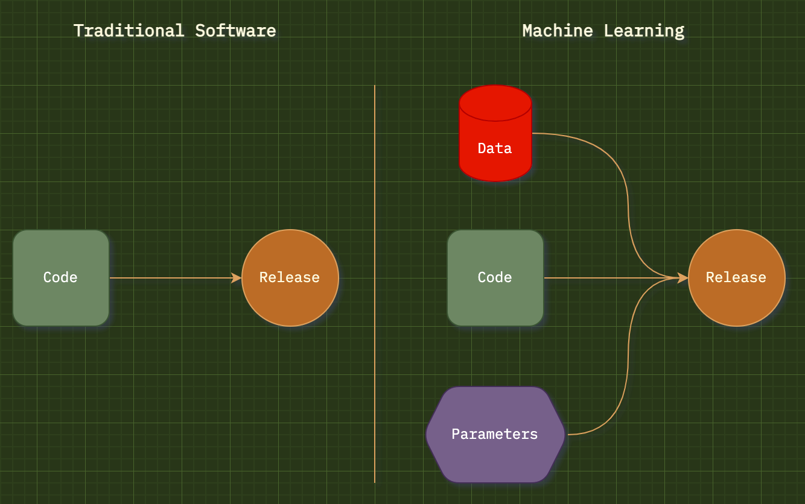
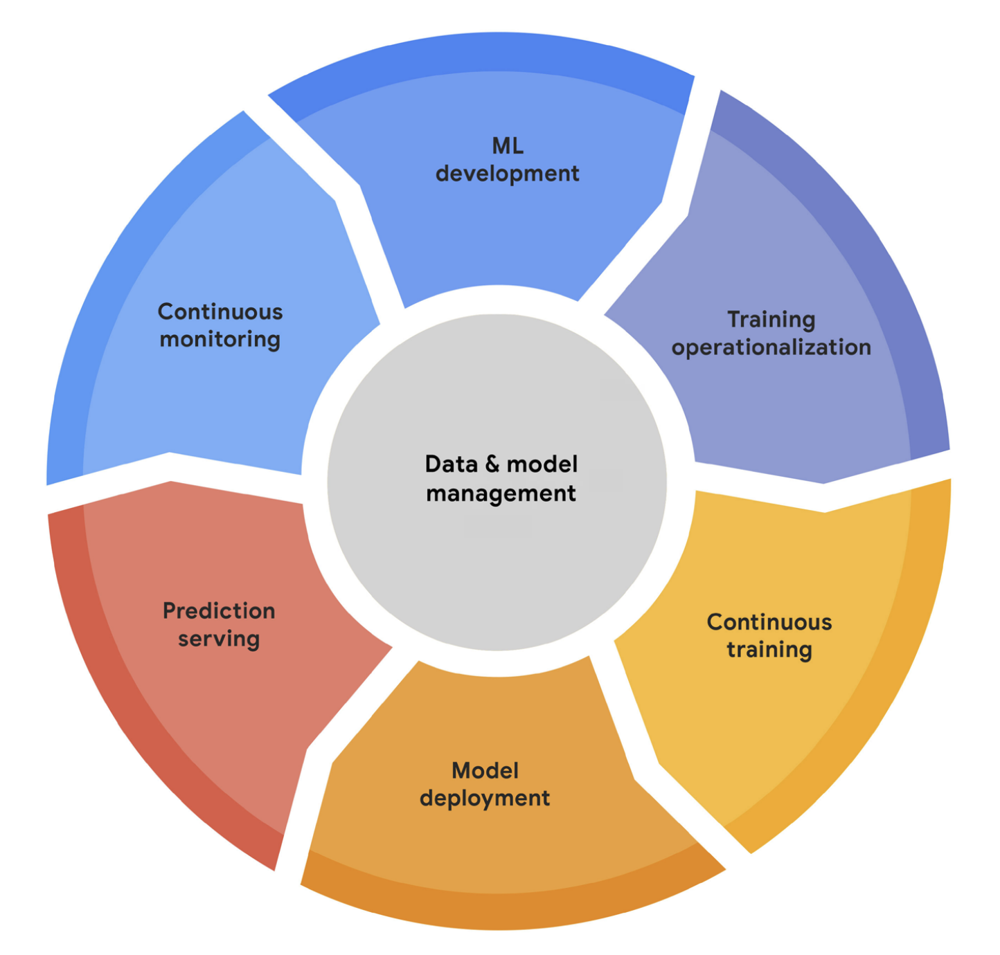

# EMLO

Extensive MLOPS

# Difference between Traditional Software & MLOPS

MLOPS lifecycle includes:

1.  Training data
2.  Model training
3.  Model validation
4.  Production data
5.  Model serving and pipelining
6.  Model service catalog(s)
7.  Model version control
8.  Infrastructure management
9.  Monitoring
10. Security
11. Governance
12. Explainability and interoperability

